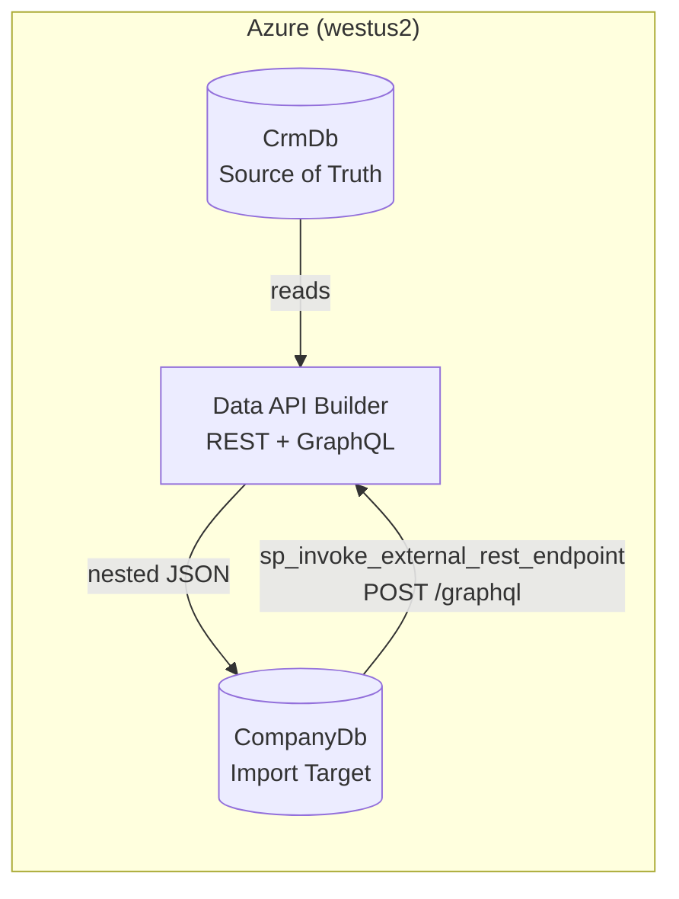
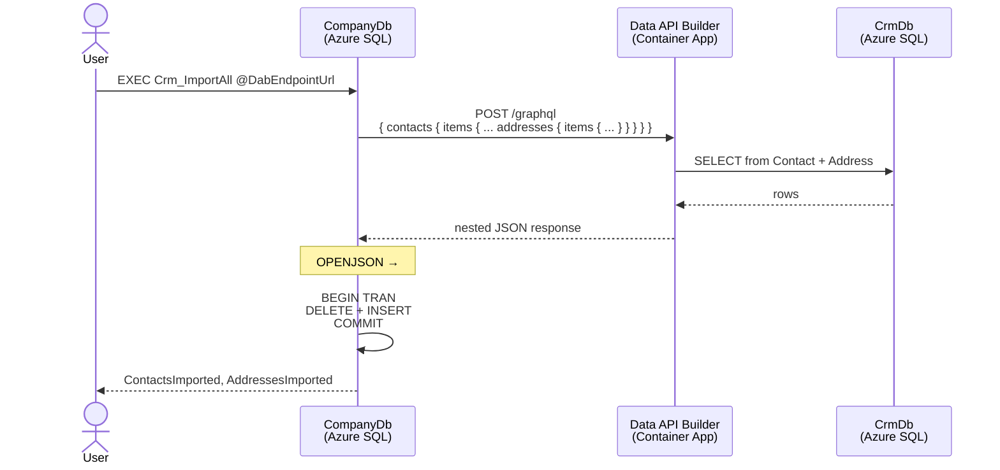
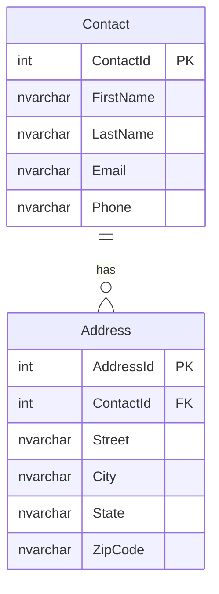
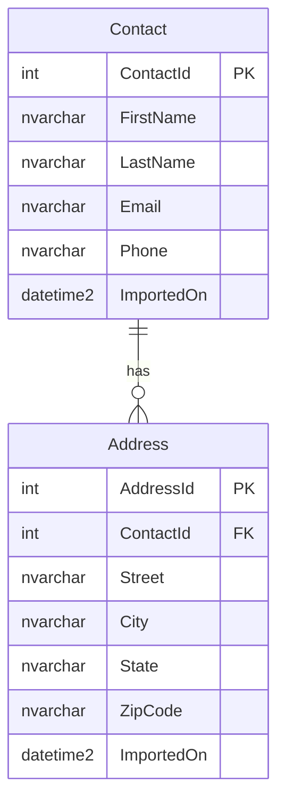
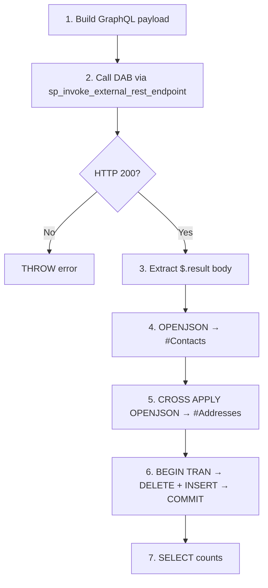
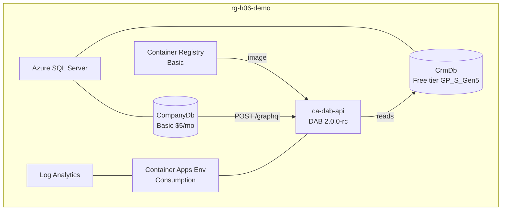

# Session H06: SQL Server + JSON — Cross-Database Import via DAB GraphQL

**Problem:** SQL Server's built-in JSON functions (`OPENJSON`, `JSON_VALUE`) can parse flat JSON, but **DAB's REST API can't return nested parent→child JSON** in a single call. How do you import hierarchical data (contacts with their addresses) from one database to another through an API layer?

**Solution:** Use **DAB's GraphQL endpoint** — which is just a `POST /graphql` with a JSON body — callable from Azure SQL via `sp_invoke_external_rest_endpoint`. GraphQL returns **nested JSON natively**, which `OPENJSON` + `CROSS APPLY` can shred into relational rows.

---

## Architecture



The CompanyDb stored procedure calls DAB's GraphQL endpoint to fetch contacts with nested addresses, then parses and inserts them locally.

---

## Data Flow (Sequence)



---

## Database Schema

### CrmDb (Source)



- IDENTITY columns (auto-increment)
- 50 seed contacts (Star Trek characters), 61 addresses

### CompanyDb (Target)



- **No IDENTITY** — IDs are imported from CRM
- `ImportedOn` defaults to `SYSUTCDATETIME()` on insert
- Includes `ContactsWithAddresses` view (LEFT JOIN)

---

## DAB Configuration

Data API Builder exposes CrmDb with anonymous access:

| Entity  | REST            | GraphQL         | Permissions |
|---------|-----------------|-----------------|-------------|
| Contact | `GET/PATCH /api/Contact` | `{ contacts { ... } }` | `*` (all CRUD) |
| Address | `GET /api/Address` | `{ addresses { ... } }` | `read` |

**Key detail:** The `Contact → Address` relationship is defined in `dab-config.json`, enabling GraphQL to return nested `addresses` inside each contact — something REST alone cannot do.

---

## The Stored Procedure: How It Works

`Crm_ImportAll` performs 7 steps:



**Key T-SQL patterns used:**

| Pattern | Purpose |
|---------|---------|
| `sp_invoke_external_rest_endpoint` | Call external HTTP endpoints from Azure SQL |
| `@timeout = 120` | Allow for ACA container cold-start |
| `OPENJSON(...) WITH (...)` | Shred JSON array into typed columns |
| `AS JSON` | Keep nested objects as raw JSON for further parsing |
| `CROSS APPLY OPENJSON` | Flatten one-to-many nested arrays |
| `BEGIN TRY / BEGIN TRAN` | Atomic DELETE + INSERT (no partial state) |

---

## GraphQL Payload

The stored procedure sends this GraphQL query:

```graphql
{
  contacts {
    items {
      ContactId
      FirstName
      LastName
      Email
      Phone
      addresses {
        items {
          AddressId
          Street
          City
          State
          ZipCode
        }
      }
    }
  }
}
```

DAB returns nested JSON like:

```json
{
  "data": {
    "contacts": {
      "items": [
        {
          "ContactId": 1,
          "FirstName": "James",
          "LastName": "Kirk",
          "Email": "kirk@enterprise.fed",
          "Phone": "555-0001",
          "addresses": {
            "items": [
              {
                "AddressId": 1,
                "Street": "1701 Constitution Ave",
                "City": "San Francisco",
                "State": "CA",
                "ZipCode": "94102"
              }
            ]
          }
        }
      ]
    }
  }
}
```

---

## Azure Infrastructure



All infrastructure defined in `infra/main.bicep`. Deployed via `infra/azure-up.ps1`.

---

## Project Structure

```
Session-H06 (SQL + JSON)/
├── README.md                          ← you are here
├── azure.yaml                         ← azd configuration
├── .gitignore
├── data-api/
│   ├── dab-config.json                ← DAB entity + relationship config
│   └── Dockerfile                     ← custom image with config baked in
├── database/
│   ├── CrmDb/                         ← source database (SQL project)
│   │   ├── CrmDb.sqlproj
│   │   ├── Tables/Contact.sql
│   │   ├── Tables/Address.sql
│   │   └── Scripts/PostDeployment.sql ← 50 contacts, 61 addresses
│   └── CompanyDb/                     ← target database (SQL project)
│       ├── CompanyDb.sqlproj
│       ├── Tables/Contact.sql         ← +ImportedOn, no IDENTITY
│       ├── Tables/Address.sql         ← +ImportedOn, no IDENTITY
│       ├── Views/ContactsWithAddresses.sql
│       ├── StoredProcedures/Crm_ImportAll.sql     ← all-in-one import
│       ├── StoredProcedures/Crm_01_Fetch.sql      ← step-by-step demo
│       ├── StoredProcedures/Crm_02_ParseContacts.sql
│       ├── StoredProcedures/Crm_03_ParseAddresses.sql
│       ├── StoredProcedures/Crm_04_Import.sql
│       ├── StoredProcedures/Crm_05_BuildJson.sql  ← write-back demo
│       ├── StoredProcedures/Crm_06_PushToCrm.sql
│       ├── StoredProcedures/Crm_RunAll.sql
│       └── Scripts/PostDeployment.sql
├── infra/
│   ├── azure-up.ps1                   ← deploy to Azure
│   ├── azure-down.ps1                 ← tear down Azure resources
│   ├── main.bicep                     ← SQL + ACR + ACA infrastructure
│   └── main.parameters.json
└── scripts/
    └── post-provision.ps1             ← azd post-provision hook
```

---

## Quick Start

### Deploy

```powershell
.\infra\azure-up.ps1
```

This will:
1. Create resource group `rg-h06-demo` in `westus2`
2. Deploy SQL Server + 2 databases + ACR + ACA via Bicep
3. Deploy CrmDb schema + seed data (50 contacts, 61 addresses)
4. Create `crmUser` (read-only on CrmDb)
5. Deploy CompanyDb schema + view + stored procedure
6. Build DAB container image with config baked in, push to ACR
7. Deploy DAB to Azure Container Apps
8. Verify DAB API is healthy

### Run the Import

Connect to CompanyDb and execute:

```sql
EXEC dbo.Crm_ImportAll
    @DabEndpointUrl = 'https://ca-dab-api.<your-env>.azurecontainerapps.io';
```

### Verify

```sql
SELECT * FROM dbo.ContactsWithAddresses;
```

---

## Demo Flow (Step-by-Step)

The procs are numbered so you can run each step independently and inspect the results.
Set the DAB URL once:

```sql
DECLARE @dab NVARCHAR(500) = 'https://ca-dab-api.<your-env>.azurecontainerapps.io';
```

### Part 1: Read from CRM (JSON → Relational)

| Step | Proc | What It Shows |
|------|------|---------------|
| 1 | `EXEC Crm_01_Fetch @DabEndpointUrl = @dab, @First = 3` | Calls GraphQL, stores raw JSON in `CrmRawJson` staging table |
| 2 | `EXEC Crm_02_ParseContacts` | `OPENJSON ... WITH` shreds contacts from the cached JSON |
| 3 | `EXEC Crm_03_ParseAddresses` | `CROSS APPLY OPENJSON` flattens nested one-to-many addresses |
| 4 | `EXEC Crm_04_Import` | `MERGE` inserts/updates Contact + Address tables (idempotent) |

**Key teaching points:**
- Step 1: GraphQL is just a POST — SQL Server calls it natively
- Step 2: `OPENJSON WITH` → typed columns from a JSON array
- Step 3: `CROSS APPLY` → the one-to-many trick for nested arrays
- Step 4: `MERGE` → idempotent, safe to rerun

### Part 2: Write back to CRM (Relational → JSON)

| Step | Proc | What It Shows |
|------|------|---------------|
| 5 | `UPDATE Contact SET Email='captain@enterprise.org' WHERE ContactId=1` | Make a local change |
| 6 | `EXEC Crm_05_BuildJson @ContactId = 1` | `FOR JSON PATH` builds REST payload from relational data |
| 7 | `EXEC Crm_06_PushToCrm @DabEndpointUrl = @dab, @ContactId = 1` | `PATCH /api/Contact/ContactId/1` sends it back to CRM |

**Key teaching points:**
- Step 6: `FOR JSON PATH, WITHOUT_ARRAY_WRAPPER` → exact JSON shape for REST
- Step 7: `sp_invoke_external_rest_endpoint` with `PATCH` → write-back via DAB REST
- Full round-trip: CRM → GraphQL → CompanyDb → JSON → REST → CRM

### Run All Steps at Once

```sql
EXEC Crm_RunAll @DabEndpointUrl = @dab, @First = 5;
```

### Tear Down

```powershell
.\infra\azure-down.ps1
```

---

## Key Insight

> **GraphQL is just REST.** It's a `POST` request with a JSON body to `/graphql`. Azure SQL's `sp_invoke_external_rest_endpoint` can call it directly — no middleware needed. This means SQL Server can fetch **nested, hierarchical JSON** from DAB and parse it with `OPENJSON` + `CROSS APPLY`, solving the limitation of DAB's flat REST responses.

---

## Prerequisites

| Tool | Purpose |
|------|---------|
| [Azure CLI](https://learn.microsoft.com/cli/azure/install-azure-cli) | Resource provisioning |
| [.NET SDK 10+](https://dotnet.microsoft.com/download) | Build SQL projects |
| [sqlpackage](https://learn.microsoft.com/sql/tools/sqlpackage) | Deploy dacpacs to Azure SQL |
| Azure subscription | Free tier SQL + ~$5/mo Basic tier |
